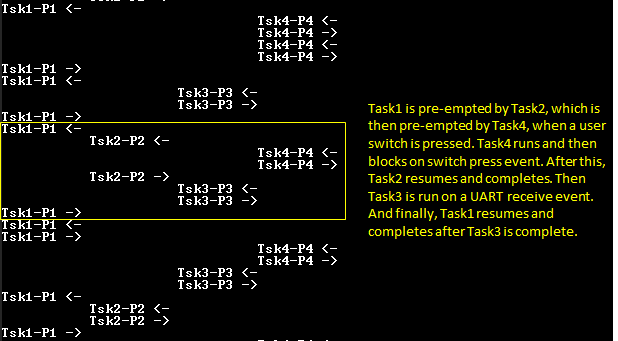

# FreeRTOS basic

This example application demonstrates context switching between different tasks having different priorites.

## Description

On [Curiosity PIC32MX470 Development Board](https://www.microchip.com/Developmenttools/ProductDetails/dm320103) and [PIC32MX274 XLP Starter Kit](https://www.microchip.com/DevelopmentTools/ProductDetails/DM320105):

This demonstration creates four tasks each of differen priority. Task1 has the lowest priority, followed by Task2, Task3 and Task4 which has the highest priority. Task1 and Task2 run periodically. 

Task3 blocks until a character is received on UART terminal. Task3 registers a read callback with the UART PLIB and blcoks on a UART receive semaphore. The semaphore is given from the registered callback which is called when a character is receved on the terminal. 

Task4 blocks until a user switch is pressed. Task4 registers a change notification callback for the switch press event with the GPIO peripheral and then blocks on the switch press semaphore. The semaphore is given from the registered callback which is called when the switch is pressed.

All the tasks print messages on the UART terminal to indicate tasks entry/exit. Since all the tasks use the same UART peripheral library, a mutex is used to guard the shared resource (UART ring buffer).

Note: Task4 is not created for [PIC32MX274 XLP Starter Kit](https://www.microchip.com/DevelopmentTools/ProductDetails/DM320105) as there is no user switch available on the board.

- **Task1**: Task1 is configured for priority 1 (lowest of all the application tasks). The task1 runs for about 100 ticks and then blocks for 10 milliseconds. Each time task1 is run, it prints a message on the UART console "Tsk1-P1 <-" where, the <- symbol indicates that task1 is running. Just before blocking it prints another message on the UART console "Tsk1-P1 ->" where, the -> symbol indicates that task1 is about to put itself into a blocked state.
- **Task2**: Task2 is configured for priority 2. The task2 runs for about 10 ticks and then blocks for 250 milliseconds. Each time task2 is run, it prints a message on the UART console "Tsk2-P2 <-" where, the <- symbol indicates that task2 is running. Just before blocking it prints another message on the UART console "Tsk2-P2 ->" where, the -> symbol indicates that task2 is about to put itself into a blocked state.
- **Task3**: Task3 is configured for priority 3. It remains blocked on a semaphore which is released when a character is entered on the UART console. Once active, the task reads out the received characters and toggles LED if letter 'L' or 'l' is pressed. The task then runs for about 50 ticks, before again blocking itself until a new character is received. Each time task3 is run, it prints a message on the UART console "Tsk3-P3 <-" where, the <- symbol indicates that task2 is running. Just before blocking it prints another message on the UART console "Tsk3-P3 ->" where, the -> symbol indicates that task3 is about to put itself into a blocked state.
- **Task4**: Task4 is configured for priority 4 (highest of all the application tasks). It remains blocked on a semaphore which is released when a user switch is pressed. Once active, the task runs for about 10 ticks, before again blocking itself until the switch is pressed again. Each time task4 is run, it prints a message on the UART console "Tsk4-P4 <-" where, the <- symbol indicates that task4 is running. Just before blocking it prints another message on the UART console "Tsk4-P4 ->" where, the -> symbol indicates that task4 is about to put itself into a blocked state.

The following figure shows possible context switching between the tasks.

   

On [PIC32 Ethernet Starter Kit](https://www.microchip.com/DevelopmentTools/ProductDetails/PartNO/DM320004) and [PIC32MX Starter Kit](https://www.microchip.com/Developmenttools/ProductDetails/DM320001):

This demonstration creates three tasks each having a differen priority. Task1 has the lowest priority, followed by Task2 and Task3 which has the highest priority.

Task1 runs periodically every 1 second and toggles LED1. Task2 also runs periodically every 250 milliseconds and polls the user switch SW2 and toggles LED2 if the switch is pressed. Task3 only runs when the user switch SW3 is pressed. Task3 registers a change notification callback on SW3 pin and then blocks on switch press semaphore. The switch press semaphore is released when the change notification callback is given. Task3 toggles LED3 and again blocks on switch press semaphore.

## Downloading and building the application

To clone or download this application from Github, go to the [main page of this repository](https://github.com/Microchip-MPLAB-Harmony/core_apps_pic32mx) and then click Clone button to clone this repository or download as zip file.
This content can also be downloaded using content manager by following these [instructions](https://github.com/Microchip-MPLAB-Harmony/contentmanager/wiki).

Path of the application within the repository is **apps/rtos/freertos/basic_freertos/firmware** .

To build the application, refer to the following table and open the project using its IDE.

| Project Name      | Description                                    |
| ----------------- | ---------------------------------------------- |
| pic32mx470_curiosity.X | MPLABX project for [Curiosity PIC32MX470 Development Board](https://www.microchip.com/Developmenttools/ProductDetails/dm320103) |
| pic32mx_eth_sk2.X | MPLABX project for [PIC32 Ethernet Starter Kit](https://www.microchip.com/DevelopmentTools/ProductDetails/PartNO/DM320004) |
| pic32mx_xlp_sk.X | MPLABX project for [PIC32MX274 XLP Starter Kit](https://www.microchip.com/DevelopmentTools/ProductDetails/DM320105) |
| pic32mx_sk.X | MPLABX project for [PIC32MX Starter Kit](https://www.microchip.com/Developmenttools/ProductDetails/DM320001) |
|||

## Setting up the hardware

The following table shows the target hardware for the application projects.

| Project Name| Board|
|:---------|:---------:|
| pic32mx_xlp_sk.X | [PIC32MX274 XLP Starter Kit](https://www.microchip.com/DevelopmentTools/ProductDetails/DM320105) |
| pic32mx470_curiosity.X | [Curiosity PIC32MX470 Development Board](https://www.microchip.com/Developmenttools/ProductDetails/dm320103) |
| pic32mx_eth_sk2.X | [PIC32 Ethernet Starter Kit](https://www.microchip.com/DevelopmentTools/ProductDetails/PartNO/DM320004) |
| pic32mx_sk.X | [PIC32MX Starter Kit](https://www.microchip.com/Developmenttools/ProductDetails/DM320001) |
|||

### Setting up [Curiosity PIC32MX470 Development Board](https://www.microchip.com/Developmenttools/ProductDetails/dm320103)

- Connect mini USB cable to the 'Debug USB' connector(J3) on the board to the computer
- Install the [USB UART click](https://www.mikroe.com/usb-uart-click) board on to the mikroBUS socket J5 of [Curiosity PIC32MX470 Development Board](https://www.microchip.com/Developmenttools/ProductDetails/dm320103)
- Connect mini USB cable to the [USB UART click](https://www.mikroe.com/usb-uart-click) board. This will enumerate the USB to UART port
- **Note:** Ensure that the series resistors on the mikroBUS headers are of value 0 Ohms

### Setting up [PIC32 Ethernet Starter Kit](https://www.microchip.com/DevelopmentTools/ProductDetails/PartNO/DM320004)

- Connect the Debug USB port on the board to the computer using a mini USB cable

### Setting up [PIC32MX274 XLP Starter Kit](https://www.microchip.com/DevelopmentTools/ProductDetails/DM320105)

- Connect micro USB cable to the 'Debug USB' connector(J9) on the board to the computer
- Install the [USB UART click](https://www.mikroe.com/usb-uart-click) board on to the mikroBUS socket J5 of [PIC32MX274 XLP Starter Kit](https://www.microchip.com/DevelopmentTools/ProductDetails/DM320105)
- Connect mini USB cable to the [USB UART click](https://www.mikroe.com/usb-uart-click) board. This will enumerate the USB to UART port

### Setting up [PIC32MX Starter Kit](https://www.microchip.com/Developmenttools/ProductDetails/DM320001)

- Connect mini USB cable to the 'Debug USB' connector(J1) on the board to the computer

## Running the Application on [Curiosity PIC32MX470 Development Board](https://www.microchip.com/Developmenttools/ProductDetails/dm320103) and [PIC32MX274 XLP Starter Kit](https://www.microchip.com/DevelopmentTools/ProductDetails/DM320105)

1. Open the Terminal application (Ex.:Tera Term) on the computer.
2. Configure the serial port settings as follows:

    Baud : 115200

    Data : 8 Bits
    
    Parity : None
    
    Stop : 1 Bit
    
    Flow Control : None
3. Build and program the application using its IDE.
4. Observe the following output on the terminal.

   

5. Enter any character on the terminal to run task3. Notice how task1 and task2 are pre-empted by task3 as task3 is of higher priority than task1 and task2. Pressing character 'l' or "L' toggles the on board LED. Notice how task1 and task2 are not run when characters are entered continuously on the terminal.

   

   

6. This step is applicable only for [Curiosity PIC32MX470 Development Board](https://www.microchip.com/Developmenttools/ProductDetails/dm320103). Press the user switch on the board to run task4. Notice how task4 preempts all other tasks as it is of highest priority.

   

Refer to the following table for LED and Switch name:

| Board | LED Name | Switch Name |
| ----- | -------- | -------- |
|  [Curiosity PIC32MX470 Development Board](https://www.microchip.com/Developmenttools/ProductDetails/dm320103) | LED1 | S1 |
|  [PIC32MX274 XLP Starter Kit](https://www.microchip.com/DevelopmentTools/ProductDetails/DM320105) | LED1 | NA |

## Running the Application on [PIC32 Ethernet Starter Kit](https://www.microchip.com/DevelopmentTools/ProductDetails/PartNO/DM320004) and [PIC32MX Starter Kit](https://www.microchip.com/Developmenttools/ProductDetails/DM320001)

1. Build and program the application using its IDE.
2. Observe LED1 toggle every 1 second.
3. Press switch SW2 and observe LED2 toggle. Switch SW2 is polled by Task2 at an interval of every 250 milliseconds.
4. Press switch SW3 and observe LED3 toggle. Switch SW3 IO pin is configured to generate a change notification interrupt. Task3 is activated by giving a semaphore in the change notification event handler.