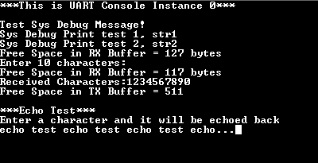

# Console Debug System Service using UART

This example application demonstrates the UART based console and debug system service.

## Description

- The application example first demonstrates the various debug system service macros
- It then demonstrates the console related APIs
- The application asks the user to enter a character on the console which is echoed back using the console system service read/write APIs

## Downloading and building the application

To clone or download this application from Github, go to the [main page of this repository](https://github.com/Microchip-MPLAB-Harmony/core_apps_pic32mx) and then click Clone button to clone this repository or download as zip file.
This content can also be downloaded using content manager by following these [instructions](https://github.com/Microchip-MPLAB-Harmony/contentmanager/wiki).

Path of the application within the repository is **apps/system/console_debug/sys_console_debug_uart_read_write/firmware** .

To build the application, refer to the following table and open the project using its IDE.

| Project Name      | Description                                    |
| ----------------- | ---------------------------------------------- |
| pic32mx470_curiosity.X | MPLABX project for [Curiosity PIC32MX470 Development Board](https://www.microchip.com/Developmenttools/ProductDetails/dm320103) |
| pic32mx470_curiosity_freertos.X | MPLABX project for [Curiosity PIC32MX470 Development Board](https://www.microchip.com/Developmenttools/ProductDetails/dm320103) |
| pic32mx_xlp_sk.X | MPLABX project for [PIC32MX274 XLP Starter Kit](https://www.microchip.com/DevelopmentTools/ProductDetails/DM320105) |
|||

## Setting up the hardware

The following table shows the target hardware for the application projects.

| Project Name| Board|
|:---------|:---------:|
| pic32mx_xlp_sk.X | [PIC32MX274 XLP Starter Kit](https://www.microchip.com/DevelopmentTools/ProductDetails/DM320105) |
| pic32mx470_curiosity.X   pic32mx470_curiosity_freertos.X | [Curiosity PIC32MX470 Development Board](https://www.microchip.com/Developmenttools/ProductDetails/dm320103) |
|||

### Setting up [Curiosity PIC32MX470 Development Board](https://www.microchip.com/Developmenttools/ProductDetails/dm320103)

- Connect mini USB cable to the 'Debug USB' connector(J3) on the board to the computer

### Setting up [PIC32MX274 XLP Starter Kit](https://www.microchip.com/DevelopmentTools/ProductDetails/DM320105)

- Connect micro USB cable to the 'Debug USB' connector(J9) on the board to the computer. 

## Running the Application

1. Open the Terminal application (Ex.:Tera term) on the computer
2. Connect to the EDBG Virtual COM port and configure the serial settings as follows:
    - Baud : 115200
    - Data : 8 Bits
    - Parity : None
    - Stop : 1 Bit
    - Flow Control : None
3. Build and Program the application using its IDE
4. Observe the following output on the terminal

    

    - First few prints demonstrate the output from the debug system service APIs
    - It then prints the free space available in the receive buffer
    - It then asks the user to enter 10 characters

5. After entering 10 characters, observe the following output on the terminal

    

    - The output first prints the free space available in the receive buffer
    - Since 10 characters are pending to be read out from the receive buffer, the free space in the receive buffer is reduced by 10
    - After this, it prints the received characters on the terminal
    - Application then waits for the transmit buffer to become empty
    - Once empty, the application prints the free space available in the transmit buffer, which should be same as the size of the transmit buffer configured in MHC minus 1

6. After this, the demonstration asks the user to enter a character, and echoes it back on the terminal.

    

    - LED toggles every-time the character is printed on the terminal

Refer to the following table for LED name:

| Board | LED Name |
| ----- | -------- |
|  [Curiosity PIC32MX470 Development Board](https://www.microchip.com/Developmenttools/ProductDetails/dm320103) | LED1 |
|  [PIC32MX274 XLP Starter Kit](https://www.microchip.com/DevelopmentTools/ProductDetails/DM320105) | LED1(RED) |
|||