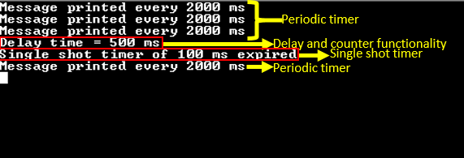

# Time System Service multi-client

This example application demonstrates the multi-client system timer functionality

## Description

- This application demonstrates timer functionality (with two clients to the Time System Service) by periodically printing a message on console every two seconds and blinking an LED every one second

- Delay, counter and single shot timer functionality is demonstrated on a switch press

- On a switch press, the application reads the current value of the 64 bit counter (say, count 1)
- It then starts a delay of 500 milliseconds and waits for the delay to expire
- Once the delay has expired, the application again reads the current value of the 64 bit counter (say, count 2) and calculates the difference between the two counter values

- The difference count indicates the time spent for the delay and is printed on the console as, "Delay time = x ms", where x is the delay value and is equal to 500 milliseconds in the given example

- The application then starts a single shot timer of 100 milliseconds
- When the single shot timer expires, a message is printed on the console that says "Single shot timer of 100 ms expired"
- This message is printed only once on every switch press

## Downloading and building the application

To clone or download this application from Github, go to the [main page of this repository](https://github.com/Microchip-MPLAB-Harmony/core_apps_pic32mx) and then click Clone button to clone this repository or download as zip file.
This content can also be downloaded using content manager by following these [instructions](https://github.com/Microchip-MPLAB-Harmony/contentmanager/wiki).

Path of the application within the repository is **apps/system/time/sys_time_multiclient/firmware** .

To build the application, refer to the following table and open the project using its IDE.

| Project Name      | Description                                    |
| ----------------- | ---------------------------------------------- |
| pic32mx470_curiosity.X | MPLABX project for [Curiosity PIC32MX470 Development Board](https://www.microchip.com/Developmenttools/ProductDetails/dm320103) |
| pic32mx_eth_sk2.X | MPLABX project for [PIC32 Ethernet Starter Kit](https://www.microchip.com/DevelopmentTools/ProductDetails/PartNO/DM320004) |
|||

## Setting up the hardware

The following table shows the target hardware for the application projects.

| Project Name| Board|
|:---------|:---------:|
| pic32mx470_curiosity.X | [Curiosity PIC32MX470 Development Board](https://www.microchip.com/Developmenttools/ProductDetails/dm320103) |
| pic32mx_eth_sk2.X | [PIC32 Ethernet Starter Kit](https://www.microchip.com/DevelopmentTools/ProductDetails/PartNO/DM320004) |
|||

### Setting up [Curiosity PIC32MX470 Development Board](https://www.microchip.com/Developmenttools/ProductDetails/dm320103)

- Connect mini USB cable to the 'Debug USB' connector(J3) on the board to the computer

### Setting up [PIC32 Ethernet Starter Kit](https://www.microchip.com/DevelopmentTools/ProductDetails/PartNO/DM320004)

- Connect the Debug USB port on the board to the computer using a micro USB cable

## Running the Application

1. Open the Terminal application (Ex.:Tera term) on the computer
2. Connect to the EDBG Virtual COM port and configure the serial settings as follows:
    - Baud : 115200
    - Data : 8 Bits
    - Parity : None
    - Stop : 1 Bit
    - Flow Control : None
3. Build and Program the application using its IDE
4. Observe the following message getting printed on the console every two seconds

    

5. Press the switch and observe the following output on the terminal (highlighted in red box)

    

    - "Delay time = 500 ms" indicates the amount of time spent during the delay
    - "Single shot timer of 100 ms expired" is printed only once on every switch press

6. LED indicates the periodic timer functionality
    - LED is toggled periodically every one second

Refer to the following table for switch and LED name:

| Board | Switch name | LED Name |
| ----- | -------- | --------- |
|  [Curiosity PIC32MX470 Development Board](https://www.microchip.com/Developmenttools/ProductDetails/dm320103) | S1 | LED1 |
|  [PIC32 Ethernet Starter Kit](https://www.microchip.com/DevelopmentTools/ProductDetails/PartNO/DM320004) | SW1 | LED1 |
||||